# Requirements Catalog

A catalog/library of requirements decomposed from open standards. Projects select which requirements they need (or create their own).

## Purpose

This repository provides the **content** (what) — the actual requirements from federal standards and NASA policies. It is separate from:

- **systems-engineering** — defines the *process* for requirements (how)
- **LaTeX** — consumes requirements for PDF generation
- **Security** — consumes requirements for toolkit traceability

## Repository Structure

```
requirements/
├── schemas/                 # JSON schemas (draft-2020-12)
│   ├── requirement-set.schema.json
│   ├── standard.schema.json
│   ├── control.schema.json
│   ├── project-selection.schema.json
│   └── cui-registry.schema.json
├── standards/               # Standard metadata (name, URL, version)
│   ├── nist-sp-800-53-r5.json
│   ├── nist-sp-800-171-r2.json
│   └── ...
├── controls/                # NIST control definitions (no implementation)
│   ├── nist-800-53/catalog.json
│   └── nist-800-171/catalog.json
├── catalog/                 # The requirements library
│   └── nasa/
│       ├── npr-2810-7/      # 72 reqs from NPR 2810.7 (Active)
│       └── nid-2810-135/    # 72 reqs from NID 2810.135 (Expired)
├── registries/              # Government registry captures
│   └── nara-cui/            # NARA CUI Registry (126 categories, 20 groupings)
├── templates/               # For consuming projects
│   ├── project-selection.json
│   └── custom-requirement-set.json
└── tools/
    ├── validate.py          # Validate JSON against schemas
    └── authority-graph.py   # Generate authority graph visualizations
```

## How Projects Consume This Catalog

Projects add this repo as a **git submodule** and create a `project-selection.json`:

```json
{
  "project": { "name": "Security Toolkit", "version": "1.17.0" },
  "selections": [
    { "source": "nasa/npr-2810-7", "include": "mandatory-only" },
    { "source": "nist/sp-800-53-r5", "include": "selected", "requirement_ids": ["AU-2", "CM-8"] }
  ]
}
```

### Adding as a submodule

```bash
git submodule add git@github.com:brucedombrowski/requirements.git requirements
git submodule update --init
```

## Key Design Decisions

- **Evolved from LaTeX JSON schema** — proven with 72 requirements; `document` renamed to `catalog_info`
- **Control catalogs are definition-only** — no `implementation` blocks (those stay in consuming projects)
- **Standards referenced by ID** — defined once in `standards/`, referenced everywhere else
- **Requirements stored as arrays** — preserves source document ordering

## Regulatory Authority Graph

NPR 2810.7 derives its authority through a chain that traces back to the Constitution. Each standard in `standards/` includes `authority` metadata linking to its legal basis. The graph below shows the authority chain (20 standards, 32 authority edges).

```mermaid
graph TD
    %% Tier 0: Constitution
    USC_CONST["U.S. Constitution"]

    %% Tier 1: Statute
    40_USC_11331["40 U.S.C. §11331"]
    44_USC_CH35["44 U.S.C. Ch. 35 (FISMA)"]
    5_USC_552["5 U.S.C. §552 (FOIA)"]
    5_USC_552A["5 U.S.C. §552a (Privacy Act)"]
    51_USC_20132["51 U.S.C. §20132"]

    %% Tier 2: Executive Order
    EO_13556["EO 13556"]

    %% Tier 3: OMB Policy
    OMB_A_130["OMB Circular A-130"]

    %% Tier 4: Federal Regulation
    32_CFR_2002["32 CFR Part 2002"]

    %% Tier 5: FIPS
    FIPS_140_2["FIPS 140-2"]
    FIPS_199["FIPS 199"]
    FIPS_200["FIPS 200"]

    %% Tier 6: NIST SP / NARA
    NARA_CUI_MARKING_HBK["NARA CUI Marking Handbook"]
    NARA_CUI_Registry["NARA CUI Registry"]
    NIST_SP_800_171["NIST SP 800-171 Rev 2"]
    NIST_SP_800_53["NIST SP 800-53 Rev 5"]
    NIST_SP_800_88["NIST SP 800-88 Rev 1"]

    %% Tier 7: Agency Policy
    NPD_2810_1F["NPD 2810.1F"]

    %% Tier 8: Agency Procedure
    NPR_2810_7["NPR 2810.7"]

    %% Tier 9: Handbook
    ITS_HBK_CUI["ITS-HBK-2810.09-02"]

    %% Authority (derives_from)
    EO_13556 -->|implements| 32_CFR_2002
    USC_CONST -->|authorized by| 40_USC_11331
    USC_CONST -->|authorized by| 44_USC_CH35
    USC_CONST -->|authorized by| 5_USC_552
    USC_CONST -->|authorized by| 5_USC_552A
    USC_CONST -->|authorized by| 51_USC_20132
    USC_CONST -->|authorized by| EO_13556
    44_USC_CH35 -->|mandated by| FIPS_140_2
    40_USC_11331 -->|mandated by| FIPS_140_2
    44_USC_CH35 -->|mandated by| FIPS_199
    40_USC_11331 -->|mandated by| FIPS_199
    44_USC_CH35 -->|mandated by| FIPS_200
    40_USC_11331 -->|mandated by| FIPS_200
    NPR_2810_7 -->|derived from| ITS_HBK_CUI
    EO_13556 -->|implements| NARA_CUI_MARKING_HBK
    32_CFR_2002 -->|implements| NARA_CUI_MARKING_HBK
    EO_13556 -->|implements| NARA_CUI_Registry
    32_CFR_2002 -->|implements| NARA_CUI_Registry
    NIST_SP_800_53 -->|derived from| NIST_SP_800_171
    32_CFR_2002 -->|mandated by| NIST_SP_800_171
    44_USC_CH35 -->|mandated by| NIST_SP_800_53
    FIPS_200 -->|implements| NIST_SP_800_53
    44_USC_CH35 -->|mandated by| NIST_SP_800_88
    51_USC_20132 -->|authorized by| NPD_2810_1F
    44_USC_CH35 -->|mandated by| NPD_2810_1F
    OMB_A_130 -->|implements| NPD_2810_1F
    EO_13556 -->|implements| NPR_2810_7
    32_CFR_2002 -->|implements| NPR_2810_7
    NPD_2810_1F -->|derived from| NPR_2810_7
    44_USC_CH35 -->|mandated by| NPR_2810_7
    44_USC_CH35 -->|authorized by| OMB_A_130
    5_USC_552A -->|implements| OMB_A_130

    %% Styling
    style 32_CFR_2002 fill:#e2e3e5
    style 40_USC_11331,44_USC_CH35,5_USC_552,5_USC_552A,51_USC_20132 fill:#cce5ff
    style EO_13556 fill:#fff3cd
    style FIPS_140_2,FIPS_199,FIPS_200 fill:#d1ecf1
    style ITS_HBK_CUI fill:#f5f5dc
    style NARA_CUI_MARKING_HBK,NARA_CUI_Registry,NIST_SP_800_171,NIST_SP_800_53,NIST_SP_800_88 fill:#e8daef
    style NPD_2810_1F fill:#fdebd0
    style NPR_2810_7 fill:#fadbd8
    style OMB_A_130 fill:#fce4ec
    style USC_CONST fill:#d4edda
```



Generate other formats: `python tools/authority-graph.py --format dot` (Graphviz), `--format tikz` (LaTeX).

## Validation

```bash
# Full validation (requires jsonschema: pip install jsonschema)
python tools/validate.py

# Verbose output
python tools/validate.py --verbose

# Validate authority graph integrity
python tools/validate.py --graph
```

## Repo Relationships

```
systems-engineering ─── defines PROCESS (how to do requirements)
         │
         ▼
   requirements ─────── provides CONTENT (the catalog)     [this repo]
      │       │
      ▼       ▼
   LaTeX   Security ─── consume via submodule
```
