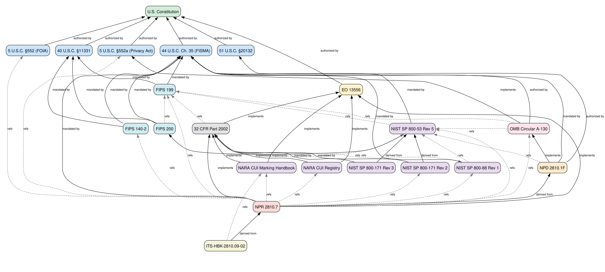

# Requirements Catalog

A catalog/library of requirements decomposed from open standards. Projects select which requirements they need (or create their own).

## Purpose

This repository provides the **content** (what) — the actual requirements from federal standards and NASA policies. It is separate from:

- **systems-engineering** — defines the *process* for requirements (how)
- **LaTeX** — consumes requirements for PDF generation
- **Security** — consumes requirements for toolkit traceability

## Repository Structure

```
requirements/
├── schemas/                 # JSON schemas (draft-2020-12)
│   ├── requirement-set.schema.json
│   ├── standard.schema.json
│   ├── control.schema.json
│   ├── project-selection.schema.json
│   └── cui-registry.schema.json
├── standards/               # Standard metadata (name, URL, version)
│   ├── nist-sp-800-53-r5.json
│   ├── nist-sp-800-171-r2.json
│   └── ...
├── controls/                # NIST control definitions (no implementation)
│   ├── nist-800-53/catalog.json
│   └── nist-800-171/catalog.json
├── catalog/                 # The requirements library
│   └── nasa/
│       ├── npr-2810-7/      # 72 reqs from NPR 2810.7 (Active)
│       └── nid-2810-135/    # 72 reqs from NID 2810.135 (Expired)
├── registries/              # Government registry captures
│   └── nara-cui/            # NARA CUI Registry (126 categories, 20 groupings)
├── sources/                 # Local PDF copies of every source document
│   ├── nist/ nasa/ nara/ federal/
├── templates/               # For consuming projects
│   ├── project-selection.json
│   └── custom-requirement-set.json
└── tools/
    ├── validate.py          # Validate JSON against schemas
    └── authority-graph.py   # Generate authority graph visualizations
```

## Clean-Room Provenance

Every standard in `standards/` references a local PDF copy under `sources/`
together with a `sha256` digest. This means the requirements decomposition
is reproducible from a fixed, in-repo source set — not a moving target on
the open internet. Verify the source set hasn't drifted with:

```bash
python tools/validate.py --sources
```

All source documents are US government works, public domain under 17 USC
§ 105.

## How Projects Consume This Catalog

Projects add this repo as a **git submodule** and create a `project-selection.json`:

```json
{
  "project": { "name": "Security Toolkit", "version": "1.17.0" },
  "selections": [
    { "source": "nasa/npr-2810-7", "include": "mandatory-only" },
    { "source": "nist/sp-800-53-r5", "include": "selected", "requirement_ids": ["AU-2", "CM-8"] }
  ]
}
```

### Adding as a submodule

```bash
git submodule add git@github.com:brucedombrowski/requirements.git requirements
git submodule update --init
```

## Key Design Decisions

- **Evolved from LaTeX JSON schema** — proven with 72 requirements; `document` renamed to `catalog_info`
- **Control catalogs are definition-only** — no `implementation` blocks (those stay in consuming projects)
- **Standards referenced by ID** — defined once in `standards/`, referenced everywhere else
- **Requirements stored as arrays** — preserves source document ordering

## Regulatory Authority Graph

Every standard in `standards/` carries `authority` metadata linking it
to its legal basis. The graph below is the **combined authority web
for the entire catalog** — every standard tracked here, every parent
it inherits authority from, every lateral reference it pulls in. As
more documents are decomposed under `catalog/`, their underlying
standards get added to `standards/` and the graph extends accordingly.

Read it **bottom-up**: each arrow points from a standard to its
authority parent, so an edge reads "FIPS 140-2 mandated by 44 U.S.C.
Ch. 35". Solid arrows are authority edges (`authority.derives_from`);
dotted arrows are lateral references (`authority.references`) — used
when a standard cites another document without deriving authority from
it (e.g., a NIST SP citing a FIPS for cryptographic requirements).

[](docs/authority-graph.svg)

> **Tip:** click the image to open the SVG directly — each node is a
> hyperlink to its standard's canonical source URL.

**Current scope:** 21 standards across 10 tiers — Constitution,
statute, executive order, OMB policy, federal regulation, FIPS, NIST
SP / NARA, agency policy, agency procedure, handbook. 34 authority
edges, 20 lateral reference edges.

Regenerate the SVG after adding or modifying any `standards/*.json`:

```bash
python tools/authority-graph.py --format dot | dot -Tsvg > docs/authority-graph.svg
```

Other output formats: `--format mermaid` (markdown-embeddable),
`--format tikz` (LaTeX). `--no-references` strips lateral edges to leave
the bare authority spine.

## Validation

```bash
# Full validation (requires jsonschema: pip install jsonschema)
python tools/validate.py

# Verbose output
python tools/validate.py --verbose

# Validate authority graph integrity
python tools/validate.py --graph

# Verify SHA-256 of every source document in sources/
python tools/validate.py --sources
```

## Repo Relationships

```
systems-engineering ─── defines PROCESS (how to do requirements)
         │
         ▼
   requirements ─────── provides CONTENT (the catalog)     [this repo]
      │       │
      ▼       ▼
   LaTeX   Security ─── consume via submodule
```
